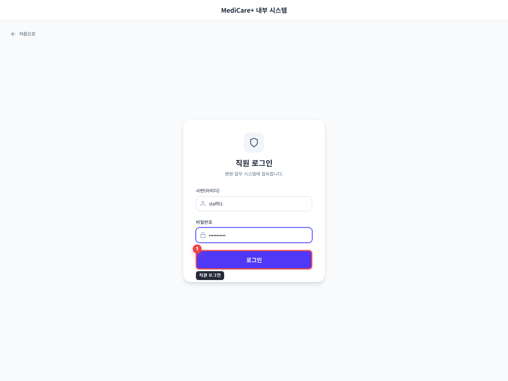

# STAFF 화면 기능 정리

`STAFF` 계정(`staff01`)으로 로그인한 뒤 확인할 수 있는 주요 원무과 화면을 정리한 문서입니다.

## 접근

1. 직원 로그인 화면에서 `staff01 / password123`로 로그인합니다.

## 접수/수납

- 당일 접수 및 수납 목록을 날짜, 상태, 진료과, 의료진 기준으로 조회할 수 있습니다.
- 예약 상태에 따라 접수, 취소, 수납 후속 처리를 이어서 수행하는 중심 화면입니다.

## 전화 예약 등록

- 환자 정보와 예약 정보를 입력해 전화 예약을 등록합니다.
- 이름, 연락처, 진료과, 의료진, 예약 일시 입력 흐름이 한 화면에 구성되어 있습니다.

## 방문 접수

- 내원 환자를 현장에서 바로 접수하는 화면입니다.
- 예약 환자 연동값을 넘겨받아 접수로 전환하는 흐름도 지원합니다.

## 물품 출고

- 원무과 사용 물품을 출고하고 당일 사용 이력을 함께 확인합니다.
- 카테고리별 조회와 사용 취소까지 같은 화면에서 처리할 수 있습니다.

## AI 챗봇

- 병원 규정 및 의료 정보 관련 질문을 입력할 수 있는 챗봇 화면입니다.
- 원무과 직원이 업무 중 빠르게 참고 정보를 얻는 용도로 사용할 수 있습니다.

## 내 정보 관리

- 개인 정보와 비밀번호를 수정하는 마이페이지 화면입니다.
- 이름, 연락처, 이메일, 비밀번호 변경 항목을 관리합니다.

